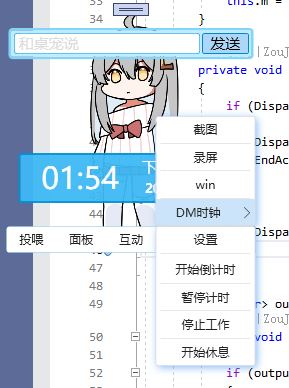
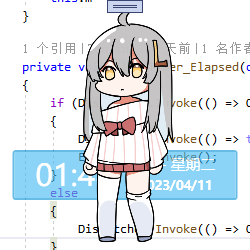
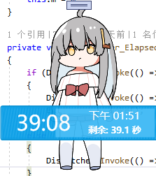
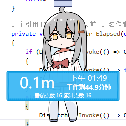
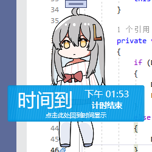

# VPet.Plugin.Demo
由开发者制作的桌宠插件案例
* DemoClock: 给桌宠添加一个时钟显示的功能
* EdgeTTS: 桌宠说话的时候附带语音,使用EdgeTTS

## VPet.Plugin.DemoClock
给桌宠添加一个时钟显示的功能,这算是代码嵌入类型MOD的DEMO

参考本软件即可编写自己的代码MOD

### 功能

给桌宠添加一个可以显示时间的钟表

* 支持倒计时
* 支持正计时
* 支持番茄钟 (工作/休息)

每次使用番茄钟完成工作,还可以获得相应时间的 [金钱] 奖励

### 相关截图

菜单栏设置

鼠标移近时突出显示状态

待机时状态

倒计时状态

番茄钟:工作状态

时间到

游戏设置窗口

## VPet.Plugin.EdgeTTS

桌宠说话的时候附带语音,使用EdgeTTS

参考本软件即可编写自己的代码MOD

### 功能

让桌宠说话的时候说出来

* 支持自定义讲述人和语音语调语速等

### 相关截图

游戏设置窗口

